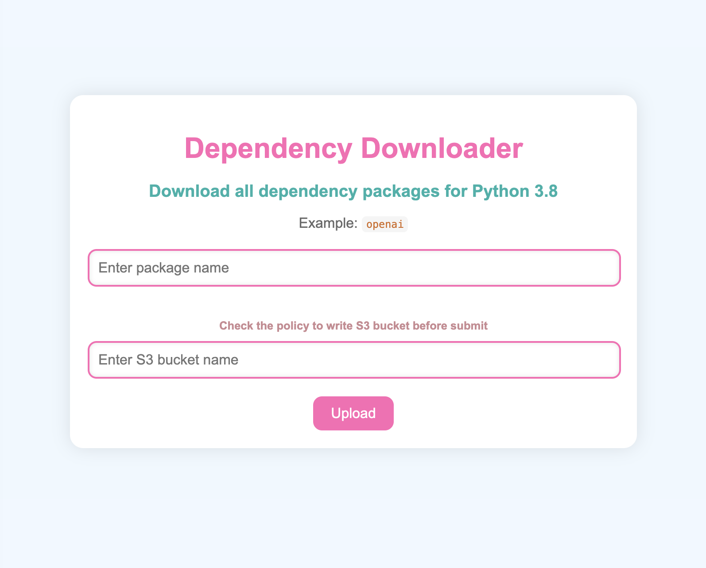

# pypi-dependencies-downloader

A simple script to download all dependencies of a package from PyPI.



## Quick Start

First of all, you need to set the environment variables in the ```.env``` file as follows:
```bash
AWS_ACCESS_KEY_ID=your_access_key_id
AWS_SECRET_ACCESS_KEY=your_secret_access_key
AWS_DEFAULT_REGION=your_default_region
```

Then, you can run the following command to start the application:


```bash
docker-compose run app
```

Access ```http://localhost:8000/``` and input the package name and the bucket name of your S3 to upload the dependencies libraries.


## Change the target platform/version
You can change the target version of the package in the ```Dockerfile```.

```Dockerfile
FROM --platform=linux/amd64 python:3.8
```

to your target platform and target version.